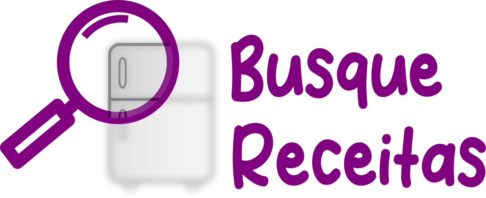

    

### Sobre
Busque Receitas é um aplicativo que tem como objetivo ajudar os usuários a otimizar seu tempo ao escolher e preparar receitas, oferecendo sugestões baseadas nos ingredientes que o usuário já tem em casa. Além disso, o aplicativo inclui uma lista de compras que indica os ingredientes necessários para preparar as receitas sugeridas. Os usuários também podem contribuir para a base de dados do aplicativo adicionando suas próprias receitas.

Para acessar a página do aplicativo na Google Play, clique neste <a href="https://play.google.com/store/apps/details?id=com.wellmath.busque_receitas" target="_blank">link</a>.

### Desenvolvimento
Esta ferramenta foi desenvolvida como parte do meu Trabalho de Conclusão de Curso no Curso de Bacharelado em Sistemas de Informação, sendo um requisito parcial para a obtenção do grau de Bacharel em Sistemas de Informação.

<h2 align="center">Capturas de tela</h2>

    
    

    
    

    
    
    

    
    

 

   Feito por <b>Darice Sousa</b>

